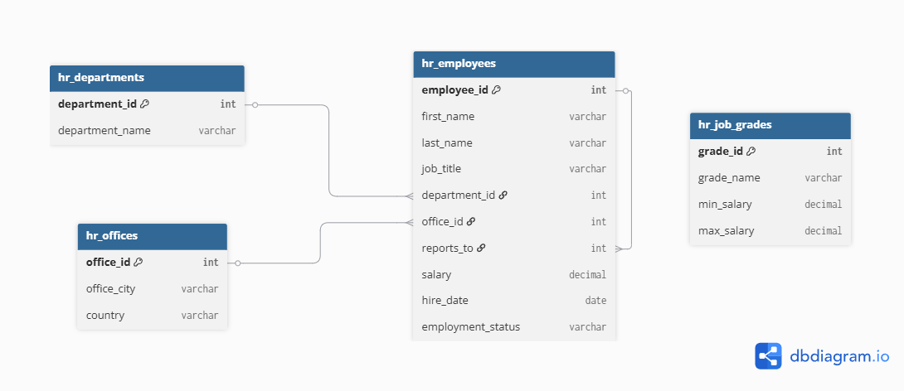
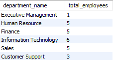
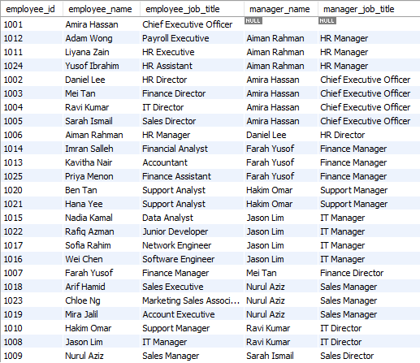
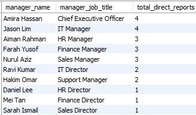
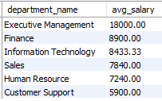
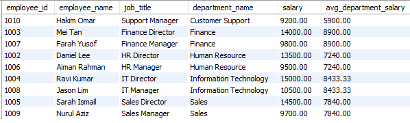
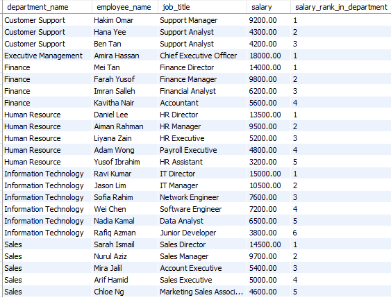
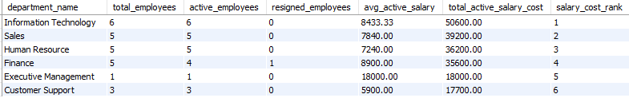

# HR Employee Analysis Using SQL

## Project Overview

This project analyzes HR employee data using SQL and dummy workforce datasets. The analysis focuses on evaluating workforce distribution, employee hierarchy, salary structure, department performance, and payroll distribution to support HR and management decision-making.

The project simulates a real-world Human Resource Management System (HRMS) using relational database design and business-focused SQL analysis.

---

## Objectives

* Analyze workforce distribution across departments
* Identify employee-manager reporting relationships
* Evaluate salary distribution across departments
* Analyze department payroll costs
* Classify employees into salary grades
* Generate HR insights using SQL

---

## Dataset Overview

The project uses dummy HR data with 4 relational tables:

* offices
* departments
* employees
* job_grades

---

## Tools & Technologies

* MySQL
* SQL
* GitHub
* Relational Database Design

---

## SQL Concepts Used

* SELECT
* WHERE
* JOINs
* LEFT JOINs
* Self JOIN
* BETWEEN
* GROUP BY
* ORDER BY
* COUNT
* SUM
* AVG
* CASE WHEN
* Common Table Expressions (CTEs)
* Window Functions
* Ranking Functions
* Salary Classification
* Workforce KPI Calculations

---

## Database Schema



---

## Project Structure

```text
HR-Employee-Analysis/
│
├── README.md
├── schema.sql
├── insert_data.sql
├── analysis_queries.sql
├── insights.md
│
└── screenshots/
    ├── er_diagram.png
    ├── employees_by_department.png
    ├── employee_manager_relationship.png
    ├── direct_reports_by_manager.png
    ├── average_salary_by_department.png
    ├── employees_above_department_average.png
    ├── salary_rank_by_department.png
    └── department_workforce_salary_summary.png
```

---

## Key Analysis & Results

### Employees by Department

Displays workforce distribution across departments to identify departments with the largest employee headcount.



---

### Employee-Manager Relationship

Uses a SQL self join to match each employee with their reporting manager, providing a clear organizational hierarchy.



---

### Direct Reports by Manager

Counts the number of employees reporting directly to each manager to evaluate leadership span of control.



---

### Average Salary by Department

Compares the average salary across departments to evaluate compensation differences within the organization.



---

### Employees Above Department Average Salary

Identifies employees whose salary exceeds the average salary of their respective department using a Common Table Expression (CTE).



---

### Salary Ranking by Department

Ranks employees by salary within each department using SQL window functions.



---

### Final Department Workforce & Salary Summary

Comprehensive department-level workforce analysis including:

* total employees
* active employees
* resigned employees
* average salary
* total salary cost
* salary cost ranking



---

## Business Insights

* Workforce distribution highlights departments with the highest staffing levels.
* Self-join analysis provides a clear reporting hierarchy between employees and managers.
* Salary comparison identifies employees earning above their department average.
* Department salary analysis highlights payroll allocation across the organization.
* Salary ranking helps compare compensation within each department.
* Workforce summary supports HR planning and budgeting decisions.

---

## Business Recommendations

* Monitor workforce distribution to ensure balanced staffing across departments.
* Review departments with high payroll costs for workforce optimization.
* Evaluate salary differences regularly to support fair compensation practices.
* Monitor manager span of control to maintain effective organizational structures.
* Use department-level salary analysis to support budgeting and future hiring decisions.

---

## Future Improvements

* Build an interactive HR dashboard using Power BI
* Integrate employee performance evaluation data
* Add employee turnover and attrition analysis
* Develop HR KPI dashboards
* Build employee attrition prediction models using Python

---

## Author

Nur Alisha Sukri — Data Analytics Graduate focused on SQL, Business Intelligence, and IT Analytics.
